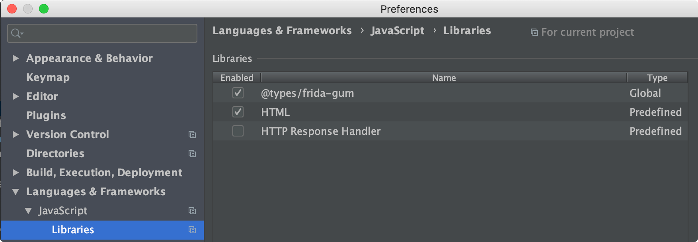

# Tiny Frida Scripts

## Setup

I used `WebStorm` from Jetbrains.  I liked `WebStorm` as you could download the `@types/frida-gum` extension.  This gave auto-complete for Frida objects. So good.
 
### Enable auto-complete


## Tips for writing Frida Scripts

### Objective-C

#### Read ObjectiveC function parameters

- 0 = 'self'
- 1 = The selector string
- 2 = The first argument

#### List Objective-C methods

```javascript
ObjC.classes.NSString.$ownMethods
ObjC.classes.NSURL.$ownMethods
```

##### ObjC.Object Properties

```javascript
const foobar = new ObjC.Object(retval)
// foobar.$className
// foobar.$moduleName
// foobar.$kind
```

#### Find C function

```javascript
DebugSymbol.fromAddress(Module.findExportByName(null, 'strstr'))
```

### Reference Counting
The Frida author wrote: 

"Never interact with Objective-C APIs without an `autorelease-pool`."_
 


##### Reading C Strings can throw errors
When dealing with `C` character arrays, `Memory.readUtf8String(args[1]);` can `throw` a Javascript error. For example:

`Error: can't decode byte 0xda in position 2 at /repl19.js:25`.

You can use: `Memory.readCString(args[1], 20)` to avoid this.  You can even limit the size of the read with an ( optional ) size value.

Or you can handle the error:
```
try {
    this._needle = Memory.readUtf8String(args[1]);
}
catch(err){
    nonDecoableChars++;             // this._needle == Javascript's undefined type
}
```
##### `lldb` convenience arguments differ to `frida`
For example:
 
 ```
-[NSString containsString:]

 -lldb  ---------------------------------

(lldb) po $arg1
haystack

(lldb) po (char *)$arg2
"containsString:"

(lldb) po $arg3
needle

-frida ---------------------------------
   Interceptor.attach(methodPointer, {
       onEnter: function (args) {
        this._needle = new ObjC.Object(args[2]);
 ```

##### Persist instance variables between onEnter() and onLeave()
```
onEnter: function (args) {
    this._needle = new ObjC.Object(args[2]);


onLeave: function (retval) {
    if(this._needle != '-') {
        // do something
    }
```
           

##### Cheat sheets
https://github.com/iddoeldor/frida-snippets